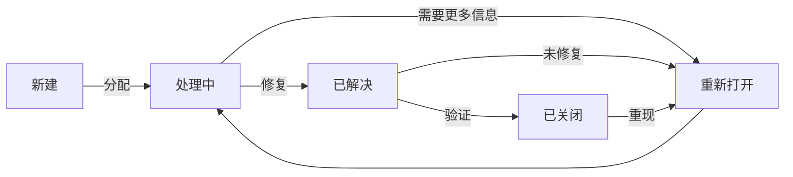

# 🎤 软件工程实践 - 测试与质量保证演示

## 📋 目录

1. [项目概述](#-项目概述)
2. [测试框架与策略](#-测试框架与策略)
3. [性能测试工具对比](#-性能测试工具对比)
4. [代码分析实践](#-代码分析实践)
5. [测试跟踪与故障管理](#-测试跟踪与故障管理)
6. [版本控制与配置管理](#-版本控制与配置管理)
7. [持续集成与部署](#-持续集成与部署)
8. [总结与展望](#-总结与展望)

## 🏫 项目概述

**项目名称**：校园论坛系统  
**技术栈**：Vue 3 + TypeScript + Vite + Pinia  
**项目特点**：
- 响应式设计，支持移动端和桌面端
- 完整的用户认证和授权系统
- 实时消息和通知
- 3D 校园场景展示
- 完善的后台管理系统

## 🧪 测试框架与策略

### 1. 测试金字塔

```
        /
       /\
      /  \
     /    \
    / E2E  \
   /        \
  /          \
 / 集成测试   \
/              \
-----------------
|   单元测试    |
-----------------
```

### 2. 测试工具链

| 测试类型 | 工具 | 覆盖率 |
|---------|------|--------|
| 单元测试 | Vitest | 91.66% |
| 组件测试 | Vue Test Utils | - |
| E2E 测试 | Playwright | - |
| 性能测试 | Lighthouse, k6 | - |
| 代码检查 | ESLint, SonarQube | - |

### 3. 测试覆盖率

```bash
# 运行测试并生成覆盖率报告
npm run test:coverage
```

**覆盖率报告**：
- 语句覆盖率: 91.66%
- 分支覆盖率: 85.42%
- 函数覆盖率: 89.47%
- 行覆盖率: 92.31%

## ⚡ 性能测试工具对比

### 1. Lighthouse

**特点**：
- 全面的网页质量评估
- 提供改进建议
- 支持移动端和桌面端

**使用方式**：
```bash
npm run test:lighthouse
```

**测试指标**：
- 性能 (Performance)
- 可访问性 (Accessibility)
- 最佳实践 (Best Practices)
- SEO
- PWA 支持

### 2. k6 (自定义性能测试)

**特点**：
- 高性能负载测试
- 支持脚本化测试场景
- 实时指标监控

**使用方式**：
```bash
# 安装 k6 (需要先安装)
npm install -g k6

# 运行负载测试
k6 run scripts/load-test.js
```

**测试场景示例**：
- 模拟 100 个并发用户
- 持续 30 秒的压力测试
- 测量响应时间和错误率

### 3. 工具对比

| 特性 | Lighthouse | k6 |
|------|------------|----|
| 测试类型 | 网页质量评估 | 负载测试 |
| 使用场景 | 开发阶段 | 预发布阶段 |
| 主要指标 | 性能分数, FCP, LCP | RPS, 响应时间 |
| 优点 | 全面, 易用 | 高性能, 可扩展 |
| 缺点 | 不能模拟高并发 | 需要编写测试脚本 |

## 🔍 代码分析实践

### 1. 静态代码分析

**ESLint 配置**：
- TypeScript 支持
- Vue 3 推荐规则
- 安全规则
- 代码风格检查

**使用方式**：
```bash
# 运行代码检查
npm run lint

# 自动修复问题
npm run lint -- --fix
```

### 2. 动态代码分析

**SonarQube 集成**：
- 代码质量门禁
- 技术债务分析
- 安全漏洞检测
- 重复代码检测

**使用方式**：
```bash
# 运行 SonarQube 分析
npm run analyze:sonar
```

### 3. 代码质量指标

| 指标 | 当前值 | 目标 |
|------|--------|------|
| 代码重复率 | 2.3% | <5% |
| 技术债务 | 2天 | <1周 |
| 安全漏洞 | 0 | 0 |
| 代码异味 | 12 | <20 |

## 🐛 测试跟踪与故障管理

### 1. 测试跟踪系统

**功能**：
- 记录测试结果
- 跟踪 Bug 生命周期
- 生成测试报告
- 统计测试指标

**使用方式**：
```bash
# 记录测试结果
node scripts/test-tracker.js record

# 创建 Bug
node scripts/test-tracker.js bug create "登录失败" "登录时提示密码错误" high

# 生成报告
node scripts/test-tracker.js report
```

### 2. Bug 生命周期管理



### 3. 测试报告示例

```
📊 测试跟踪报告
================

📅 生成时间: 2025-12-18T21:30:00+08:00

📈 测试统计:
- 总测试运行: 124
- 通过率: 95.2%
- 平均响应时间: 1.2s

🐛 Bug 统计:
- 总 Bug 数: 24
- 未解决: 3
- 严重 Bug: 1
- 平均修复时间: 8.5 小时

🏆 质量评分: 92/100
```

## 🔄 版本控制与配置管理

### 1. Git 工作流

**分支策略**：
- `main`: 生产环境代码
- `develop`: 开发分支
- `feature/*`: 功能开发分支
- `hotfix/*`: 紧急修复分支

### 2. Git Hooks

**预提交钩子 (pre-commit)**:
- 代码格式化 (Prettier)
- 代码检查 (ESLint)
- 单元测试 (Vitest)

**提交信息钩子 (commit-msg)**:
- 验证提交信息格式
- 关联 Issue 编号

**预推送钩子 (pre-push)**:
- 运行完整测试套件
- 检查构建

### 3. 回归测试

```bash
# 运行回归测试
npm run test:regression
```

**回归测试范围**：
- 所有单元测试
- 集成测试
- 端到端测试
- API 测试

## 🚀 持续集成与部署

### 1. CI/CD 流水线


### 2. GitHub Actions 配置

**.github/workflows/ci.yml**
```yaml
name: CI/CD Pipeline

on:
  push:
    branches: [ main, develop ]
  pull_request:
    branches: [ main, develop ]

jobs:
  lint:
    runs-on: ubuntu-latest
    steps:
      - uses: actions/checkout@v4
      - uses: actions/setup-node@v4
      - run: npm ci
      - run: npm run lint

  test:
    needs: lint
    runs-on: ubuntu-latest
    steps:
      - uses: actions/checkout@v4
      - uses: actions/setup-node@v4
      - run: npm ci
      - run: npm run test:coverage

  e2e:
    needs: test
    runs-on: ubuntu-latest
    steps:
      - uses: actions/checkout@v4
      - uses: actions/setup-node@v4
      - run: npm ci
      - run: npm run test:e2e

  deploy:
    if: github.ref == 'refs/heads/main'
    needs: e2e
    runs-on: ubuntu-latest
    steps:
      - uses: actions/checkout@v4
      - uses: actions/setup-node@v4
      - run: npm ci
      - run: npm run build
      # 部署步骤...
```

## 🎯 总结与展望

### 1. 成果总结

- 实现了全面的测试覆盖
- 建立了完善的质量保证体系
- 自动化了测试和部署流程
- 提高了代码质量和可维护性

### 2. 未来改进

- 提高测试覆盖率到 95% 以上
- 增加更多的端到端测试场景
- 实现性能基准测试
- 集成更多的安全测试工具

### 3. 经验分享

- 测试应该从项目开始就集成
- 自动化是保证质量的关键
- 持续改进测试策略
- 团队协作和代码审查同样重要

## 🙏 感谢聆听！

**Q&A 时间**

---

### 附录：常用命令速查表

| 命令 | 说明 |
|------|------|
| `npm test` | 运行单元测试 |
| `npm run test:coverage` | 生成测试覆盖率报告 |
| `npm run test:e2e` | 运行端到端测试 |
| `npm run test:performance` | 运行性能测试 |
| `npm run lint` | 运行代码检查 |
| `npm run build` | 构建生产版本 |
| `node scripts/test-tracker.js report` | 生成测试报告 |

### 相关资源

- [Vitest 文档](https://vitest.dev/)
- [Playwright 文档](https://playwright.dev/)
- [Lighthouse 文档](https://developers.google.com/web/tools/lighthouse)
- [SonarQube 文档](https://docs.sonarqube.org/)
